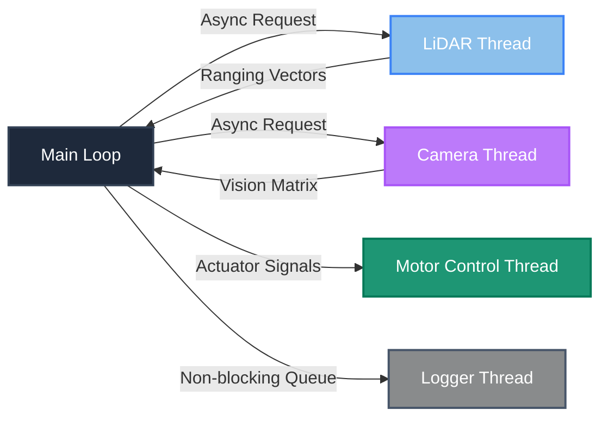

<div class="relative z-10 flex flex-col justify-center items-center h-full mt-25">

<!-- Slide 1 -->
# Performance Engineering in Autonomous Driving
Comparing latency and throughput of vision and ranging data pipelines

<br>
<br>

Author: Dezső Binder
<br>
Supervisor: Johannes Feiner

</div>

---
transition: slide-up
---
<!-- Slide 2 -->
# Agenda

<div class="grid grid-cols-3 gap-5 mt-12">
  
  <div v-click.fade-in class="p-5 rounded-xl border border-white/20 bg-white/5">
    <div class="font-mono text-xs text-blue-400 mb-1">01</div>
    <div class="text-xl font-semibold">Motivation</div>
    <div class="text-sm opacity-70 mt-2">Industry Context & Tesla FSD</div>
  </div>
  
  <div v-click.fade-in class="p-5 rounded-xl border border-white/20 bg-white/5">
    <div class="font-mono text-xs text-emerald-400 mb-1">02</div>
    <div class="text-xl font-semibold">The Problem</div>
    <div class="text-sm opacity-70 mt-2">Sensor Blindness & Constraints</div>
  </div>

  <div v-click.fade-in class="p-5 rounded-xl border border-white/20 bg-white/5">
    <div class="font-mono text-xs text-purple-400 mb-1">03</div>
    <div class="text-xl font-semibold">Architecture</div>
    <div class="text-sm opacity-70 mt-2">Fusion & Asymmetric Trust</div>
  </div>

  <div v-click.fade-in class="p-5 rounded-xl border border-white/20 bg-white/5">
    <div class="font-mono text-xs text-yellow-400 mb-1">04</div>
    <div class="text-xl font-semibold">Implementation</div>
    <div class="text-sm opacity-70 mt-2">3-Ray Scan Optimization</div>
  </div>

  <div v-click.fade-in class="p-5 rounded-xl border border-white/20 bg-white/5">
    <div class="font-mono text-xs text-orange-400 mb-1">05</div>
    <div class="text-xl font-semibold">Results</div>
    <div class="text-sm opacity-70 mt-2">Latency & Robustness Benchmarks</div>
  </div>

  <div v-click.fade-in class="p-5 rounded-xl border border-white/20 bg-white/5">
    <div class="font-mono text-xs text-red-400 mb-1">06</div>
    <div class="text-xl font-semibold">Conclusion</div>
    <div class="text-sm opacity-70 mt-2">Summary & Future Outlook</div>
  </div>

</div>

<!-- Slide 3 -->
---
transition: slide-up
---

# Motivation

<div class="grid grid-cols-2 gap-10 mt-15">

  <div v-click class="duration-800 text-center">
    
    <h2 class="text-3xl font-bold tracking-tight">Tesla</h2>
    <p class="opacity-50 mt-2">The "Human" Approach <br/>Cameras Only</p>
  </div>

  <div v-click class="duration-800 text-center">
    
    <h2 class="text-3xl font-bold tracking-tight text-emerald-400">Waymo</h2>
    <p class="opacity-50 mt-2">The "Robot" Approach <br/>LiDAR + Radar</p>
  </div>

</div>

<!-- Slide 4 -->
---
transition: slide-up
---

# Problem

<div class="grid grid-cols-3 gap-8 mt-10">

  <div v-click="1" class="duration-800 p-8 rounded-3xl border border-white/10 bg-white/5 text-center">
    <div class="text-xs font-mono opacity-40 mb-0 uppercase tracking-widest">RQ1</div>
    <h2 class="!text-3xl !font-extrabold !text-emerald-400">Accuracy</h2>
    <p class="opacity-50 mt-4 text-xs">Obstacle blindness.</p>
    <div class="relative w-full aspect-video mt-6 rounded-xl overflow-hidden border border-white/10">
      
      
    </div>
    <p v-click="3" class="text-[10px] opacity-40 mt-2 transition-opacity duration-1000">Vision Failure at < 25cm</p>
  </div>

  <div v-click="4" class="duration-800 p-8 rounded-3xl border border-white/10 bg-white/5 text-center">
    <div class="text-xs font-mono opacity-40 mb-0 uppercase tracking-widest">RQ2</div>
    <h2 class="!text-3xl !font-extrabold !text-blue-400">Efficiency</h2>
    <p class="opacity-50 mt-4 text-xs">25ms constraint.</p>
    <div v-click="5" class="mt-6 p-4 bg-blue-500/10 rounded-xl border border-blue-500/20">
      <div class="text-xs font-bold text-blue-400 uppercase tracking-tighter">Human Threshold</div>
      <div class="text-2xl font-bold">~13ms</div>
      <p class="text-[10px] opacity-40 mt-1 italic">Target: Real-Time Parity</p>
    </div>
  </div>

  <div v-click="6" class="duration-800 p-8 rounded-3xl border border-white/10 bg-white/5 text-center flex flex-col justify-between">
    <div>
      <div class="text-xs font-mono opacity-40 mb-0 uppercase tracking-widest">RQ3</div>
      <h2 class="!text-3xl !font-extrabold !text-purple-400">Robustness</h2>
      <p class="opacity-50 mt-4 text-xs">Uncontrolled worlds.</p>
      <div class="relative w-full aspect-video mt-6 rounded-xl overflow-hidden border border-white/10">
      
    </div>
    </div>
  </div>

</div>


<!-- Slide 5 -->
---
transition: slide-up
---

# Uncontrolled environment

<div class="mt-8 rounded-3xl overflow-hidden border border-white/10 shadow-2xl w-full max-w-3xl mx-auto bg-black">
  <video autoplay loop muted playsinline class="w-full h-full object-cover">
    <source src="/demo.mp4" type="video/mp4">
  </video>
</div>

<!-- Slide 6 -->
---
transition: none
---

# Architecture

<div class="grid grid-cols-10 gap-6 mt-8">
  <div v-click="1" class="col-span-4 flex flex-col justify-center mt-10">
    <div class="p-4 rounded-xl border border-red-500/20 bg-red-500/5 text-xs text-red-300 italic">
      Problem: High loop jitter and a critical safety lag
    </div>
  </div>

  <div v-click="2" class="col-span-7 flex flex-col justify-center">
    <h3 class="text-xl font-bold text-purple-400 flex items-center gap-2 mb-4">
      <carbon:direction-fork /> Decoupling the processes
    </h3>
    <div class="border border-white/10 rounded-2xl overflow-hidden bg-white/5">
      <table class="w-full text-left text-sm border-collapse">
        <thead>
          <tr class="border-b border-white/10 bg-white/5 text-slate-400 font-mono text-xs">
            <th class="p-4">Architecture</th>
            <th class="p-4">Avg Latency</th>
            <th class="p-4">FPS Equiv.</th>
            <th class="p-4">Blind Distance (at 60 cm/s)</th>
          </tr>
        </thead>
        <tbody>
          <tr class="border-b border-white/10 opacity-50">
            <td class="p-4 font-semibold">Single-Thread</td>
            <td class="p-4 font-mono">168.6 ms</td>
            <td class="p-4 font-mono">5.9</td>
            <td class="p-4 font-mono text-red-400">10.1 cm</td>
          </tr>
          <tr class="bg-emerald-500/5 text-emerald-300">
            <td class="p-4 font-bold">Multi-Thread</td>
            <td class="p-4 font-mono font-bold">16.2 ms</td>
            <td class="p-4 font-mono">61.7</td>
            <td class="p-4 font-mono font-bold text-emerald-400">1.0 cm</td>
          </tr>
        </tbody>
      </table>
    </div>
    <p v-after class="text-[11px] opacity-40 mt-3 italic text-left">
      *Decoupling background tracking reduced physical blind distance by 90.1%
    </p>
  </div>
</div>

<!-- Slide 7 -->
---
transition: slide-up
---

# Architecture
<div class="mt-32 flex justify-center items-center w-full transform scale-200">


</div>
<!-- Slide 8 -->

---
transition: slide-up
---

# Min-Trust Model

````md magic-move [fusion_strategy.py] {lines: true}
```python {*|1-2|3-4|6}
class FusionStrategy(ObstacleStrategy):
    def __init__(self):
        self.lidar = LidarStrategy()
        self.camera = CameraStrategy()

    def check_path(self):
        ...

    def stop(self):
        ...
```
```python {*|1-2|3-4|7-8|10-11|13-14|15-16}
class FusionStrategy(ObstacleStrategy):
    def check_path(self):
        l_front, l_left, l_right = self.lidar.check_path()
        c_front, c_left, c_right = self.camera.check_path()

        # Exclusively trust LiDAR for lateral navigation
        final_left = l_left
        final_right = l_right

        camera_is_blind = (c_front == CAMERA_ERROR_TOKEN) # 999
        lidar_sees_wall = (l_front < SAFETY_BUFFER_CM)

        if camera_is_blind and lidar_sees_wall:
            final_front = l_front
        else:
            final_front = min(l_front, c_front)

        return final_front, final_left, final_right

    def stop(self):
        ...
```
````